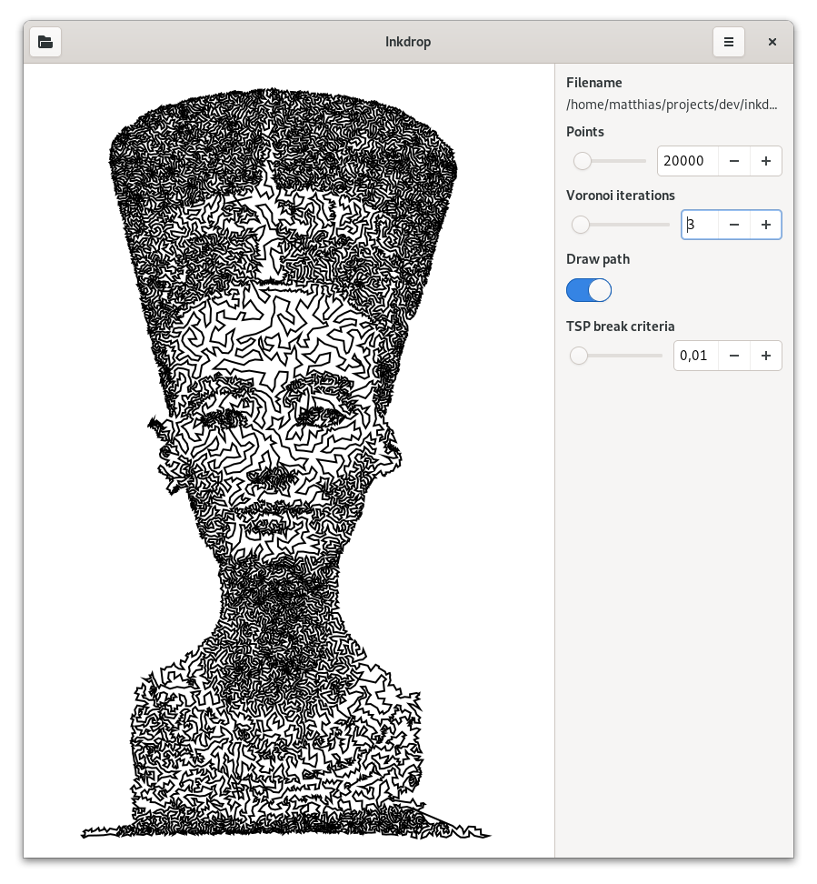
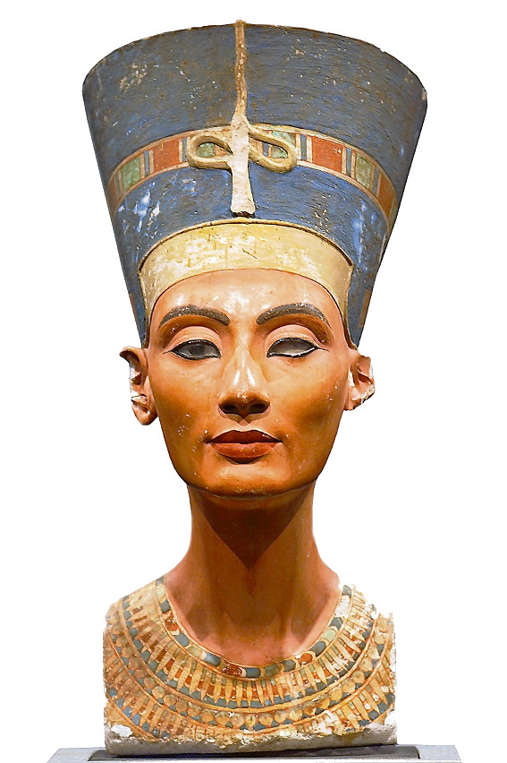

## inkdrop

inkdrop is an artsy bitmap to vector converter controlled via a GTK4 or [web UI](https://matze.github.io/inkdrop).

### Command line interface

The CLI binary is called `inkdrop-cli` and reads almost any image bitmap format
via the `--input` parameter and outputs an SVG document given by the `--output`
parameter. Let's take this image of the Nefertiti bust, cropped and the
background turned to pure white:

Using the `--draw-points` parameter we can output all sampled points. The number
of sampled points can be controlled with the `--num-points` parameter. Calling

    $ inkdrop-cli --input nofretete.png \
                  --output output.svg \
                  --draw-points \
                  --num-points 20000

gives us

It resembles the input image but due to the stochastic nature, it is a bit
noisy. We can move these initial points using the Weighted Voronoi method.
Using

    $ inkdrop --input nofretete.png \
                  --output output.svg \
                  --draw-points \
                  --num-points 20000 \
                  --voronoi-iterations 100

we get points that much better reflect the structure of the original image:

By leaving out the `--draw-points` parameter, all points will be connected.
Without further adjustments the nearest neighbor tour is chosen which will be
ugly most of the time because the path crosses itself. To fix that use the
`--tsp-improvement` parameter which optimizes the tour using the 2-opt algorithm
until the improvement is not better than the parameter given. So our final
command line

    $ inkdrop-cli --input nofretete.png \
                  --output output.svg \
                  --num-points 20000 \
                  --voronoi-iterations 100
                  --tsp-improvement 0.001

gives us the following output:

### GTK4 user interface

Call `inkdrop-ui` and play around with the same parameters as above.

### Web user interface

The `web` crate contains a web app based on [Yew](https://yew.rs) with a demo
hosted [here](https://matze.github.io/inkdrop). Run `make` and serve the content
with a server of your choice. `python -m http.server` could be a simple option.
