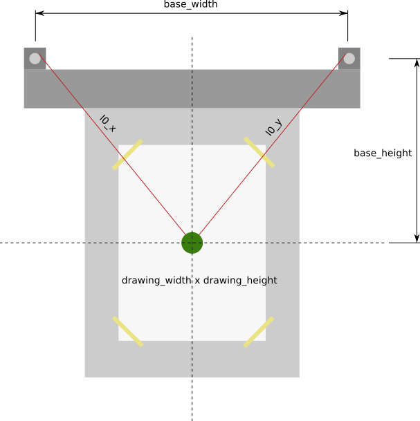

## inkdrop

inkdrop is an artsy bitmap to vector converter controlled via a GTK4 or [web UI](https://matze.github.io/inkdrop).


### Command line interface

The CLI binary is called `inkdrop-cli` and reads almost any image bitmap format
via the `--input` parameter and outputs an SVG document given by the `--output`
parameter. Let's take this image of the Nefertiti bust, cropped and the
background turned to pure white:


Using the `--draw-points` parameter we can output all sampled points. The number
of sampled points can be controlled with the `--num-points` parameter. Calling

    $ inkdrop-cli --input nofretete.png \
                  --svg output.svg \
                  --draw-points \
                  --num-points 20000

gives us


It resembles the input image but due to the stochastic nature, it is a bit
noisy. We can move these initial points using the Weighted Voronoi method.
Using

    $ inkdrop --input nofretete.png \
                  --svg output.svg \
                  --draw-points \
                  --num-points 20000 \
                  --voronoi-iterations 100

we get points that much better reflect the structure of the original image:


By leaving out the `--draw-points` parameter, all points will be connected.
Without further adjustments the nearest neighbor tour is chosen which will be
ugly most of the time because the path crosses itself. To fix that use the
`--tsp-improvement` parameter which optimizes the tour using the 2-opt algorithm
until the improvement is not better than the parameter given. So our final
command line

    $ inkdrop-cli --input nofretete.png \
                  --svg output.svg \
                  --num-points 20000 \
                  --voronoi-iterations 100
                  --tsp-improvement 0.001

gives us the following output:


#### gcode conversion

To create gcode ready to send to your drawing machine, you need to execute
two steps:

- Use `inkdrop-cli` with the `--json` option (which will in addition to the SVG
write a point list in JSON format as well)
- Use `gcode-converter` with the resulting JSON and a claibration file.

The calibration is derived from the measurements of your individual machine. A file
looks like this:

```json
{
  "base_width": 300.0,
  "base_height": 560.0,
  "drawing_width": 300.0,
  "drawing_height": 450.0
}
````



Now use this to call the CLI:

    $ gcode-converter --calibration calib.json
                      --input nofretete.json
                      --output nofretete

which will create `N` gcode files in directory `nofretete`, where `N` is the number of 
channels of your picture.

**Important:** The gcode coordinates assume the home position `(0, 0)` to be in the *center of the drawing area*, so the *origins
of both coordinate systems are equal*. In practice, this means:

- position in the center of the drawing area
- position the pen in the center of the paper
- reset the positions in your controller (reset to zero)


### GTK4 user interface

Call `inkdrop-ui` and play around with the same parameters as above.


### Web user interface

The `web` crate contains a web app based on [Yew](https://yew.rs) with a demo
hosted [here](https://matze.github.io/inkdrop). Run `make` and serve the content
with a server of your choice. `python -m http.server` could be a simple option.
